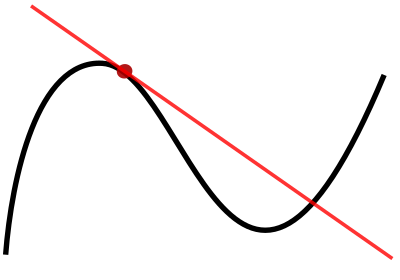
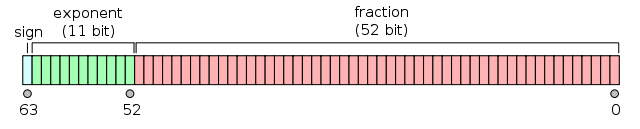

# Hack the Derivative

By Erik Taubeneck


## Follow Along

The Python functions used in this article are available on [PyPI](https://pypi.python.org/pypi/hackthederivative/0.0.1) and [GitHub](https://github.com/eriktaubeneck/hack-the-derivative/releases/tag/v0.0.1). These links are directly to the version as of publishing, but the latest version (if any changes have been made in the mean time) are easily available from there. To follow along at home:

```
$ mkdir somewhere_new
$ cd somewhere_new
$ virtualenv venv
$ source venv/bin/activate
$ pip install hackthederivative=0.0.1
$ python
>>> from hackthederivative import *
```

## Introduction

The derivative (the mathematical flavor, not the financial) is one of the first things that a young calculus student learns. By the time they are formally taught it, it's likely that a student has already encountered the idea before; the slope of a line (rise over run!) is typically taught a couple years before. The student has likely already thought about the relationship between position, speed, and acceleration in physics, even if they have not seen it directly in a class.

It is not only the first piece of calculus that young mathematicians see; the derivative is one of the most important cornerstones of advanced mathematics, particularly in applied fields. Physics, statistics, economics, engineering, finance, and, yes, even computer science would not exist without the derivative. (There is plenty of other math, too, that they rely on as well.)

Computing the derivative (as opposed to calculating it by hand) has become a critical procedure in many of these applied fields, utilizing the power of the computer to magnify their work. Standard approaches for this calculation exist, but as is always the case with computational mathematics, there are limits and tradeoffs.

Modern 64-bit computers can do exact operations on the [ring](https://en.wikipedia.org/wiki/Ring_(mathematics)) of integers modulo 18,446,744,073,709,551,615, represented unsigned as `$\{z \in \mathbb{Z} \mid 0 <= z < 2^{64}-1 \}$` or signed as `$\{z \in \mathbb{Z} \mid -2^{63} <= z < 2^{63}-1 \}$`. But a ring only gets you addition, subtraction, and multiplication (note the auspicious absence of division.) When taking derivatives, we are typically working with the [real numbers](https://en.wikipedia.org/wiki/Real_number) where we have division and more fancy properties. Unfortunately, the real numbers can not be represented in a computer. In fact, any of the irrational numbers (say `$\pi$` or `$\sqrt{2}$`) cannot individually be represented (even with all the atoms in the visible universe!)

[Floating point numbers](https://en.wikipedia.org/wiki/Floating_point) are the computational approximation of the real numbers, and the work quite nicely for a great deal of calculations. They are just that, an approximation, which wields its ugly head in the most standard way of computing the derivative, the finite difference method. To understand that, we will look into the derivative itself and the implementation of the floating point numbers. Once we understand the issue at hand, we'll find an interesting solution in one of the most important theorems in modern mathematics, the [Cauchy-Riemann equations](https://en.wikipedia.org/wiki/Cauchy%E2%80%93Riemann_equations). To tee this up, we'll have to understand a little bit about the imaginary number (`$i$` in math, `j` in Python) and complex numbers. Then we'll be ready to hack the derivative.


## The Derivative

Informally, the derivative is a mathematical method for determining the slope of a line (that could be nonlinear), at a specific point. Slightly more formal, (but not mathematically rigorous, yet) the derivative tells us the slope of the tangent line which intersects the line at the specific point, as shown in the following image from [Wikipedia](https://en.wikipedia.org/wiki/Tangent#/media/File:Tangent_to_a_curve.svg):

<p align="center">

</p>

Formally, the derivative of `$f(x)$`, `$f'(x)$`, is a new function which tells us the *slope* of the tangent line that intersects `$f$` at any given `$x$`. Mathematically, we define this as

`\begin{equation}
 f'(x) = \lim_{h \to 0} \frac{f(x+h) - f(x)}{h}.
\end{equation}`

### Exampe 1

Consider the function `$f(x) = x^2$`. To find the derivative `$f'(x)$`, we can plug `$f$` right into the definition:

`\begin{eqnarray*}
    f'(x) &&  = \lim_{h \to 0} \frac{(x+h)^2 - x^2}{h} \\
    && = \lim_{h \to 0} \frac{x^2 + 2xh + h^2 - x^2}{h} \\
    && = \lim_{h \to 0} \frac{2xh + h^2}{h} \\
    && = \lim_{h \to 0} 2x + h \\
    && = 2x.
\end{eqnarray*}`
<p align="right"><code>
$\Box$
</code>
</p>

### Exampe 2

Let's put a little more meat on it. Consider the function `$f(x) = sin(x)$`. We're going to rely on the following [trigonometric identity](https://en.wikipedia.org/wiki/List_of_trigonometric_identities#Product-to-sum_and_sum-to-product_identities) and a lemma (proofs omitted):

`\begin{equation}
 \sin \theta \pm \sin \varphi = 2 \sin \left ( \frac{ \theta \pm \varphi}{2} \right ) \cos \left ( \frac{ \theta \mp \varphi}{2} \right )
\end{equation}
\begin{equation}
 \lim_{\theta \to 0} \frac{\sin \theta}{\theta} = 1.
 \end{equation}`

Now, to find the derivative `$f'(x)$`, we again plug `$f$` right into the definition:

`\begin{eqnarray*}
    f'(x) &&  = \lim_{h \to 0} \frac{\sin(x+h) - \sin x}{h} \\
    && = \lim_{h \to 0} \frac{ 2 \sin \left ( \frac{ x + h - x }{2} \right ) \cos \left ( \frac{ x + h + x }{2} \right )}{h} \\
    && = \lim_{h \to 0} \frac{ 2 \sin \left ( \frac{ h }{2} \right ) \cos \left ( \frac{ 2x + h }{2} \right )}{h} \\
    && = \lim_{h \to 0} \frac{ 2 \sin \left ( \frac{ h }{2} \right ) \cos \left ( x + \frac{ h }{2} \right )}{h} \\
    && = \lim_{h \to 0} \frac{ \sin \left ( \frac{ h }{2} \right )}{\frac{h}{2}} \cos \left ( x + \frac{ h }{2} \right ) \\
    && = \lim_{h \to 0} \frac{ \sin \left ( \frac{ h }{2} \right )}{\frac{h}{2}} \lim_{h \to 0} \cos \left ( x + \frac{ h }{2} \right ) \\
    && = 1 * \lim_{h \to 0} \cos \left ( x + \frac{ h }{2} \right ) \\
    && = \cos x.
\end{eqnarray*}`
<p align="right"><code>
$\Box$
</code>
</p>

This is obviously just the tip of the derivative iceberg, and I encourage you to checkout [Wikipedia](https://simple.wikipedia.org/wiki/Derivative_(mathematics)) or a [text book](https://books.google.com/books?id=AavjDHGwGpIC&lpg=PP1&dq=calculus&pg=PP1#v=onepage&q&f=false_) if you feel uninitiated.

## Finite Difference

The most common approach for computationally estimating the derivative of a function is the [_finite difference method_](https://en.wikipedia.org/wiki/Finite_difference_method). The basic idea is quite simple: take the definition of the derivative, but instead of taking the limit as `$h \to 0$`, we simple evaluate for a small `$h$`. The derivation, however, is a bit more involved, and uses the [Taylor Series expansion](https://en.wikipedia.org/wiki/Taylor_series):

`\begin{eqnarray*}
    f(x + h) && = f(x) + \sum_{n = 1}^{\infty} \frac{f^{(n)}(x)}{n!}h^n \\
             && = f(x) + f'(x)h + \sum_{n = 2}^{\infty} \frac{f^{(n)}(x)}{n!}h^n
\end{eqnarray*}`

where `$f^{(n)}$` is the `$n^{th}$` derivative of `$f$`. Solving for `$f'$`, we get

`\begin{eqnarray*}
    f'(x) && = \frac{f(x+h) - f(x)}{h} - \sum_{n = 1}^{\infty} \frac{f^{(n)}(x)}{n!}h^{(n-1)} \\
\end{eqnarray*}`

and thus the error of such approximation is

`\begin{eqnarray*}
    \mathcal{E}(h, x) = \sum_{n = 1}^{\infty} \frac{f^{(n)}(x)}{n!}h^{(n-1)}.
\end{eqnarray*}`

For our purposes, we are attempting to find the derivative at a specific value of `$x = x_0$`, so our error is completely a function of `$h$` and `$\mathcal{E}(b, x_0)$` is a strictly monotonically increasing function (i.e. it decreases as `$h \to 0$`). Thus, it seems best that we should use `$h$` as small as possible. Implemented in Python:

```python
In [1]:def finite_difference(f, x, h):
           return (f(x+h) - f(x))/h
```

To test this out:

```python
In [2]: f = lambda x: x**2
In [3]: print finite_difference(f, 1.0, 0.00001)
Out[3]: 2.00001000001393
```

(Remember from Example 1 that `$f'(x) = 2x$` for `$f(x) = x^2$`, and so `$f'(1) = 2$`.) This is fairly accurate, but can take it further? As discussed earlier, we are using floating point numbers, so in Python we can try this out with the smallest float.

```python
In [4]: import sys
In [5]: print finite_difference(f, 1.0, sys.float_info.min)
Out[5]: 0.0
```

This is clearly the wrong answer. Since `h = 0.00001` was reasonably small and worked before, you may be tempted to just use that. Unfortunately, it can break too: consider the case where `$x_0 = 10^{20}$`.

```python
In [6]: finite_difference(f, 1.0e20, 0.00001)
Out[6]: 0.0.
```

To understand what is happening here, we'll take a closer look at the floating point numbers.

## Floating Point Numbers

A [Float64](https://en.wikipedia.org/wiki/Double-precision_floating-point_format), or a double-precision floating-point number, consists of

<p align="center">

</p>

and represents a real number `$x \in \mathbb{R}$` with `$sign$`, `$e$`, and `$b_i \in \{0,1\}$` such that

`\begin{equation}
  (-1)^{sign} (1.b_{51}b_{50}...b_{0})_2 \ 2^{e-1023}
\end{equation}`

or, potentially more readable,

`\begin{equation}
    (-1)^{sign} \left ( 1 + \sum_{i=1}^{52} b_{52-i} 2^{-i} \right ) \times 2^{e-1023}.
\end{equation}`

In essence, floating point numbers have three main components: the sign, the exponent which (gives us scale), and the fraction (which gives us precision). This is much like scientific notation, e.g. `$5.916829373 \times 10^{23}$`, but in base two. For the following example, we'll use base ten scientific notation, since it's a bit easier to work with.

This format allows for two numbers to be multiplied and divided without loss of precision:

`\begin{eqnarray*}
     && (5.916829373 \times 10^{23}) \times (7.208209342 \times 10^{-51}) \\
  =  && 5.916829373 \times 10^{23} \times 7.208209342 \times 10^{-51} \\
  =  && 5.916829373 \times 7.208209342 \times 10^{23} \times 10^{-51} \\
  =  && (5.916829373 \times 7.208209342) \times (10^{23} \times 10^{-51}).
\end{eqnarray*}`

Due to associativity and commutativity, we can rearrange and compute these operations separately. This is not the case, however for addition and subtraction:

`\begin{eqnarray*}
     && (5.916829373 \times 10^{23}) + (7.208209342 \times 10^{-51}) \\
  =  && (5.916829373 \times 10^{23}).
\end{eqnarray*}`

This may seem obvious, but it means that the floating point numbers have gaps. For each floating point (except the largest one), there is a next one. More importantly, the gaps of between each floating point number and the next one change as the floating point numbers get larger. We can see this in Python:

```python
In [1]: import sys
In [2]: plus_epsilon_identity(x, eps):
            return x + eps == x
In [3]: eps = sys.float_info.min
In [4]: plus_epsilon_identity(0.0, eps)
Out[4]: False
In [5]: plus_epsilon_identity(1.0, eps)
Out[5]: True
In [6]: plus_epsilon_identity(1.0e20, 1.0)
Out[6]: True
```

Now, given `x_0`, if we choose `h` so small such that `x_0 + h == x_0`, then

`\begin{equation}
\frac{f(x_0 +h) - f(x_0)}{h} = \frac{f(x_0) - f(x_0)}{h} = \frac{0}{h} = 0.
\end{equation}`

This is clearly undesirable. To take this on, first, we need to understand the size of the gaps. In Python:

```
In  [7]: def eps(x):
             e = float(max(sys.float_info.min, abs(x)))
             while not plus_epsilon_identity(x, e):
                 last = e
                 e = e / 2.
             return last
In [8]: eps(1.0)
Out[8]: 2.220446049250313e-16
In [9]: eps(1.0e10)
Out[9]: 1.1102230246251565e-06
In [10]: eps(1.0e20)
Out[10]: 11102.230246251565
```

[Lecture notes posted by Karen Kopecky](http://www.karenkopecky.net/Teaching/eco613614/Notes_NumericalDifferentiation.pdf) use the same Taylor series approximation of the error above, and ultimately sugest using

`\begin{equation}
    h = \sqrt{u} \times \max(\left \vert x \right \vert, 1)
\end{equation}`

where `$u = eps(1)$`. We can update our finite difference method accordingly:

```python
In [11]: def finite_difference(f, x, h=None):
             if not h:
                 h = sqrt(eps(1.0)) * max(abs(x), 1.0)
             return (f(x+h) - f(x))/h
```

We can test this out on some functions which we know the derivative of:

```python
In [12]: def error(f, df, x):
             return abs(finite_difference(f, x) - df(x))

In [13]: def error_rate(f, df, x):
            return error(f, df, x) / df(x)

In [14]: f, df = lambda x:x**2, lambda x:2*x
In [15]: error_rate(f, df, 1.0)
Out[15]: 7.450580596923828e-09
In [16]: error_rate(f, df, 1.0e5)
Out[16]: 9.045761108398438e-09
In [17]: error_rate(f, df, 1.0e20)
Out[17]: 4.5369065472e-09

In [18]: import math
In [19]: f, df = math.sin, math.cos
In [20]: error_rate(f, df, 1.0)
Out[20]: 1.2780011808656197e-08
In [21]: error_rate(f, df, 1.0e10)
Out[21]: 1.002014830004253
In [22]: error_rate(f, df, 1.0e20)
Out[22]: 0.9999999999998509
```

This is mostly pretty good. It's important to note that it's a bit unreasonable to try and calculate a periodic function (let alone the derivative) at a floating point number where the gaps are far bigger than the periodicity. For the others, however, we can do better. But we will have to use math.

## Complex Analysis

Have you ever tried to solve `$x^2 + 1 = 0$`? If you have, you'll know that it is impossible for all `$x \in \mathbb{R}$`, and if you haven't, it should be quite obvious. We would need `$x^2 = -1$`, but when we square a real number, it will stay positive if it's positive, become positive if it's negative, or stay `$0$` if it's `$0$`. In order to solve this, we actually need to bring in a whole new set of numbers: the _imaginary numbers_. We define

`\begin{equation}
  i = \sqrt{-1}
\end{equation}`

and then, together with the real numbers, build the complex numbers as:

`\begin{equation}
  \mathbb{C} = \{x + iy \ \forall \ x,y \in \mathbb{R}^2 \}.
\end{equation}`

We can now solve our dreaded `$x^2 + 1 = 0$` with `$\pm i$`. In fact, all polynomials of degree `$n$` will have `$n$` zeros in `$\mathbb{C}$`. There is plenty to explore in within the realm of complex analysis, but we are going to focus on the derivative.

### Example 3

Consider

`\begin{equation}
  f(x) = z^2.
\end{equation}`

Let `$z = x + iy$`. Then

`\begin{eqnarray*}
  f(z) && = f(x+iy) && = (x+iy)^2 = x^2 +2ixy + i^2y^2 \\
       &&           && = x^2 + 2ixy - y^2.
\end{eqnarray*}`

A function can always be written in terms of their _real_ and _imaginary_ parts, e.g. `$f(x+iy) = u(x,y) + iv(x,y)$`. These can also be written as `$\mathfrak{R}(f)$` and `$\mathfrak{I}(f)$`, respectively. Note that both `$u$` and `$v$` are real valued functions, and `$x$` and `$y$` are both real numbers. In our example, we have

`\begin{equation}
  u(x,y) = x^2 - y^2 \ \mathrm{and} \ v(x,y) = 2xy.
\end{equation}`

We now have two equations, both of two variables, and so we can take four derivatives:

`\begin{eqnarray*}
\frac{\partial u}{\partial x} = 2x && \frac{\partial v}{\partial x} = 2y \\
\frac{\partial u}{\partial y} = -2y && \frac{\partial v}{\partial y} = 2x.
\end{eqnarray*}`

Note that:

`\begin{eqnarray*}
  \frac{\partial u}{\partial x} = \frac{\partial v}{\partial y}, &&
  \frac{\partial u}{\partial y} = -\frac{\partial v}{\partial x}.
\end{eqnarray*}`

These are the [Cauchy-Riemann equations](https://en.wikipedia.org/wiki/Cauchy%E2%80%93Riemann_equations) and they hold for all analytic functions on $\C$! (See [Marsden and Hoffman](https://books.google.com/books?id=Z26tKIymJjMC&lpg=PP1&dq=complex%20analysis&pg=PA66#v=onepage&q&f=false) for a proof.) This theorem is going to give us the power to hack the derivative.

## Hack the Derivative

Given our function `$f: \mathbb{R} \to X \subseteq \mathbb{R}$`, we can rewrite as

`\begin{equation}
  f(x) = f(x+iy) = u(x,y) + iv(x,y)
\end{equation}`

Now, for the subset of `$\mathbb{C}$` such that `$\bar{z} \in \mathbb{R}$`, we know that `$y = 0$`. Then

`\begin{equation}
  f(\bar{z}) = f(x,0) = u(x,0) + iv(x,0).
\end{equation}`

Similarly, since `$f: \mathbb{R} \to X \subseteq \mathbb{R}$`, `$f(\bar{z}) \in \mathbb{R}$`. Then

`\begin{equation}
  v(x,0) = 0
\end{equation}`

and so

`\begin{equation}
  f(x,0) = u(x,0).
\end{equation}`

We are attempting to estimate `$\frac{df}{\partial x}$`. Since for all `$\bar{z} \in \mathbb{R}$` we know `$f=u$`,

`\begin{equation}
  \frac{df}{\partial x} = \frac{\partial u}{\partial x} = \frac{\partial v}{\partial y}.
\end{equation}`

Using the definition of the derivative,
`\begin{equation}
  \frac{\partial v}{\partial y} = \lim_{h \to 0} \frac{v(x,y+h) - v(x,y)}{h}.
\end{equation}`

Since `$y = 0$` for all `$\bar{z} \in \mathbb{R}$`,

`\begin{equation}
  \frac{\partial v}{\partial y} = \lim_{h \to 0} \frac{v(x,h) - v(x,0)}{h}.
\end{equation}`

Recall that `$v(x,0) = 0$`, so

`\begin{equation}
  \frac{\partial v}{\partial y} = \lim_{h \to 0} \frac{v(x,h)}{h}.
\end{equation}`

Now, to estimate `$\frac{df}{\partial x} = \frac{\partial v}{\partial y}$`, for a very small `$h$`

`\begin{equation}
  \frac{df}{\partial x} \approx \frac{v(x,h)}{h} = \frac{\mathfrak{Im}(f(x+ih))}{h}.
\end{equation}`

<p align="right"><code>
$\Box$
</code>
</p>

Python has native support for complex numbers, so we can implement this as

```python
In [1]: import sys
In [2]: def complex_step_finite_diff(f, x):
           h = sys.float_info.min
           return (f(x+h*1.0j)).imag / h
In [3]: f, df = lambda x:x**2, lambda x:2*x
In [4]: complex_step_finite_diff(f, 1.0)
Out[4]: 2.0
In [5]: complex_step_finite_diff(f, 1.0e10)
Out[5]: 20000000000.0
In [6]: complex_step_finite_diff(f, 1.0e20)
Out[6]: 2e+20
```

The results here are stunning. We can formally test this out the same way as above:

```python
In [7]: def cerror(f, df, x):
           return abs(complex_step_finite_diff(f, x) - df(x))

In [8]: def cerror_rate(f, df, x):
           return cerror(f, df, x) / x
In [9]: cerror_rate(f, df, 1.0)
Out[9]: 0.0
In [10]: cerror_rate(f, df, 1.0e10)
Out[10]: 0.0
In [11]: cerror_rate(f, df, 1.0e20)
Out[11]: 0.0

In [12]: import cmath

In [13]: f, df = cmath.sin, cmath.cos
In [14]: cerror_rate(f, df, 1.0)
Out[14]: 0.0
In [15]: cerror_rate(f, df, 1.0e10)
Out[15]: 0.0
In [16]: cerror_rate(f, df, 1.0e20)
Out[16]: 0.0
```

Again, stunning, but we can find _some_ cases where it's not perfect:

```python
In [17]: cerror_rate(f, df, 1.0e5)
Out[17]: .110933124815182e-16
In [18]: f = lambda x: cmath.exp(x) / cmath.sqrt(x)
In [19]: df = lambda x: (cmath.exp(x)* (2*x - 1))/(2*x**(1.5))
In [20]: cerror_rate(f, df, 1.0)
Out[20]: 0.0
In [21]: cerror_rate(f, df, 1.0e2)
Out[21]: 1.1570932160552342e-16
In [22]: cerror_rate(f, df, 5.67)
Out[22]: 1.2795419601231268e-16
In [23]: cerror_rate(f, df, 1.0e3)
Out [23]: OverflowError: math range error
```

As you can see, the implementation of some complex functions have limitations. We also will not be able to use `abs` (it's imaginary part is `$0$` by definition) or a function with `$<$` or `$>$` in it (the complex numbers [are not ordered](https://en.wikipedia.org/wiki/Complex_number#Ordering)).


## Conclusion

TODO
